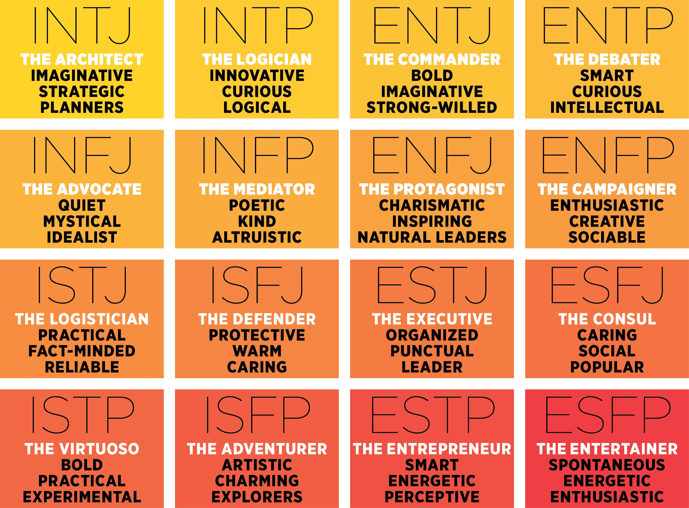

#   Myers Briggs Personality Prediction

University of Texas at Austin, Data Bootcamp 2019-2020

Group Members - Ekta Sharma | David Altuve | Kat Jansen

## Project Purpose 

The purpose of this project is to predict personality types as one of the sixteen categories of Myers Briggs personality types (MBTI) based on the correlation between people's writing styles and their psychological personalities. We believe that social media gives people the platform to express themselves freely and openly and hence those posts can be an indicator of their personality type.  
We acknowledge the fact that all personality types are equal. 

## Tools & Modules Used

*   Machine Learning - Natural Language Processing | Classification Models | Scikit Learn | NLTK | Sentiment Analyzer | Pipeline | Imbalance Learn | TF-IDF
*   Data Analysis - Pandas | Numpy | Matplotlib
*   APP – Flask | Python
*   Templates – HTML | CSS | Bootstrap
*   Deployment - GCP (Google Cloud Platform) | Docker

## Methodology
1.  **Class Imbalance:** To examine the proportionality of each of the sixteen personality types, Matplotlib was used to plot the value counts of each of these sixteen types. Since the classes were heavily imbalanced, following steps were taken:

*   First step was to divide the single “type” feature into four features:
    *   Extroversion vs. Introversion
        *   I - 0
        *   E - 1
    *   Sensing vs. Intuition
        *   N - 0
        *   S - 1
    *   Thinking vs. Feeling
        *   F - 0   
        *   T - 1
    *   Judging vs. Perceiving
        *   P - 0
        *   J - 1
*   The second step was to use random under sampling technique when building machine learning model. 

2.  **Finding Correlation:** Pandas correlation method was used to plot the correlation matrix to look for the presence of any strong correlations between any of the four personality features. No correlation was found.

3.  **Feature Engineering:** Following steps were taken to prepare the data for machine learning models:

    **Cleaning the Data**
    *   Posts were converted into lower case.
    *   ||| and punctuations were replaced by spaces.
    *   Links and Emails were dropped.
    *   MBTI personality types were dropped. There was quite a few uses of these types in the posts and we didn’t find them adding any value.
    *   Words with one to two character length were dropped.
    *   The cleaned data generated after executing above steps was Lemmitized using NLTK Word Net Lemmitizer. Stop Words were dropped at this stage.
    *   The result of these steps stored as “clean posts” was cleaned and lemmatized set of words for each user.

    **Sentiment Scoring**
    Sentiment Intensity Analyzer was used to calculate compound, positive, negative and neutral sentiment score for each user using the clean posts.

    **Part of Speech Tagging**
    NLTK POS tagger was used to tag each word with its part of speech tag. The average number of each of the POS tags was calculated for each user based on the original posts. The POS tags included were – Noun, Pronoun, Verb, Adverb, Adjective, Conjunction, Determiners, Numbers, Prepositions, Particles and Punctuations.

    **Counting**
    Per user average counts were taken for number of question marks, exclamations, colons, emojis, words, unique words, upper case words, links, ellipses and images. These counts were our additional features for the machine learning models covered in next step.

4.  **Machine Learning Models:** This was our final step. Various classifications models were used in this step on the dataset.

    *   The data was split into X (input features) and y (target).
        *   X comprised of clean posts, compound sentiment score, pos tag counts, and various other counts.
        *   Y was set to four target features - is_Extrovert, is_Sensing, is_Thinking, is_Judging
    *   Preprocessing step was designed to vectorize the clean posts and to select k best features out of the other (non-word) features using column transformer.
    *   Since the data was imbalanced Imbalance Learn Pipeline was used to create the models. The pipeline was composed of preprocess (from the above step), random under sampler (to handle class imbalance) and the classification model.
    *   Following models were built, trained and tested on dataset:
        TF-IDF Logistic Regression
        Count Vectorized Logistic Regression
        TF-IDF Logistic Lasso
        Count Vectorized Logistic Lasso
        TF-IDF Logistic Ridge
        Count Vectorized Logistic Ridge
        TF-IDF Logistic Elasticnet
        TF-IDF Support Vector Classifier
        Count Vectorized Support Vector Classifier
        TF-IDF Naive Bayes
        Count Vectorized Naive Bayes
        TF-IDF Random Forest
        Count Vectorized Random Forest
    *   Evaluation Metrics – Accuracy, Precision, Recall, ROC-AUC and Average Precison_Recall_Score were used as the measures to evaluate the models and select the one performing the best.
    *   Final Model – Based on the scores for the evaluation metrics used, TF-IDF Logistic Regression Model was selected as the final model for predicting Myers Briggs personality type.

5.   **Feature Importance Using Final Model**

    
       

6. **Challenges Faced & Conclusions Drawn:** 
    The dataset was heavily imbalanced with most people identifying as introverted (I) and Intuitive (N) rather than extroverted (E) and Sensitive (S). This caused all our models to have a hard time classifying Extroversion vs. Introversion and Sensitivity vs. Intuition. We were able to overcome this problem to some extent by using Imbalance Learn’s Random Under Sampling method. This improved the scores but not significantly. We also added extra words that didn’t seem to be very helpful in classifying a personality trait to the stop words list to make the model predict more efficiently. Our model is able to predict 2 to 4 traits out of a total of 4 traits and we consider this as success because even for human readers it is difficult to accurately predict a person’s Myers Briggs personality type.

    In our future efforts to improve this model, we plan to add more data specifically for the types that have low counts in our current dataset to balance the classes. We also want to implement a neural network based model in an attempt to see if that can outperform our current model in accurately predicting all 4 traits of the Myers Briggs personality type.